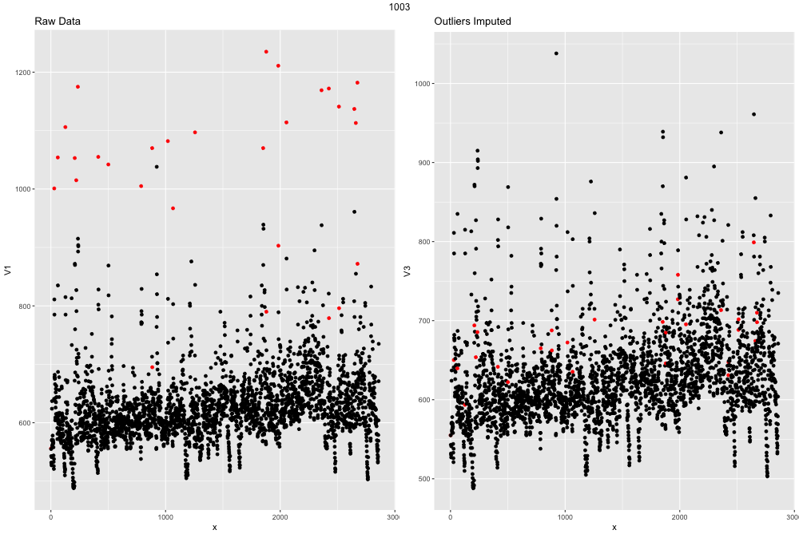
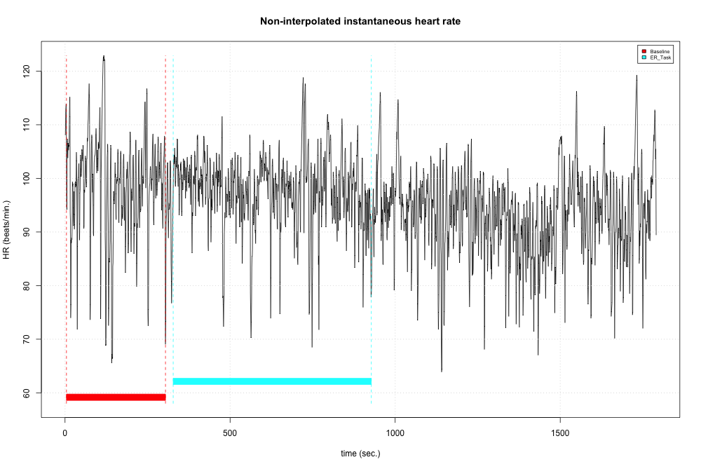
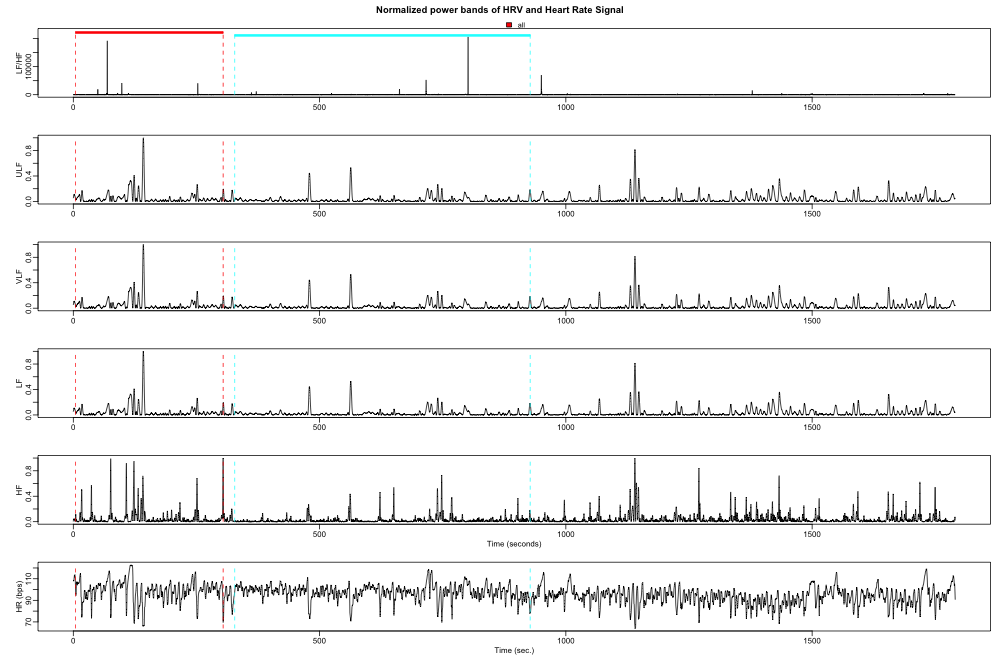

```{r global_options, include=FALSE}
knitr::opts_chunk$set(echo=TRUE, warning=FALSE, message=FALSE, fig.align = 'center')
```
# Introduction
## Rationale and Pipeline Purpose
The basic rationale for dedicating the time and energy into developing this pipeline started
out as selfish: I found myself running the same code over and over again (i.e., breaking the
archtyical coding "rule of three"). However, since its inception, bits and pieces of this
pipeline have turned into more general functions for use with collaborators (even a
new package, [`fizzr`](https://github.com/d-bohn/fizzr)),
and as a teaching mechanism (e.g., [various tutorials](https://d-bohn.github.io/tutorials/hrv_tutorial.html)).

### Some Caveats
First, this is, arguably, not the *most* efficient way to pre-process,
analyze, and store data, but due to the nature of physiological data cleaning and analysis,
it is useful to have files saved to the physical disk at each step, despite their
large size.

Second, I did not write any of the functions provided by the `PhysioScripts` suite of
functions. That was originally written by Israel C. Christe. There is a relevant
publication on that in
[*Behavioral Research Methods*](https://www.ncbi.nlm.nih.gov/pmc/articles/PMC3767411/).
I've started work on the `fizzr` package to port the `PhysioScripts` functions to a
standard package so it can benefit from continued development.

## Data Structure, Experimental Desaign, and Hypotheses
### Experiment
Briefly, experiment examined the influence of cardiac vagal tone (e.g., high frequency heart
rate variability) on subtle emotion detection in faces.

## Method
Myriad studies have linked differences in autonomic physiology to differences in regulatory processes.
Fewer studies, on the other hand, have explored the link between changes in autonomic physiology and
perception, especially perception of salient social information. Of the few studies examining
this physiological-perceptual link, only a handful have investigated baseline-to-task changes
(i.e., flexibility) in ANS activity 
([Muhtadie et al. (2015)](http://psycnet.apa.org/record/2014-57454-001)).
The present research aims to fill this gap by extending previous work to social stimuli (faces).

Participants completed a five minute baseline task (sitting silently) followed by a subtle
emotion identification task in which they had to select from a minimally expressive and
neutral face the same actor the face that looked most expressive. Following this subtle
emotion identification task, participants underwent a one minute baseline period before
filling out a number of survey questionnaires.

### Physiology Measures
Participants were run individually. A Biopac MP150 collected physiological measurements at a
sampling rate of 1000 Hz. The physiological measurements collected were:

  1) Electrocardiogram (EKG)
  
  2) Cardiac Impedance
  
  3) Electrodermal Activity (GSR)
  
  4) Skin temperature

# Quality Assurance Pipeline
## Pipeline
### Load Custom Functions
```{r setwd}
pacman::p_load(dplyr, tidyr, ggplot2, R.utils, here)
load(here('R/PhysioScript.RData'))
source(here("R/physio_functions_new.R"))
```

### A Note on Reproducibility
Because the functions written for this pipeline are designed for this specific
project, they are dependent on a certain file structure. All of the functions
check to see if the appropriate folder/file is available, but in order to
maximize reproducibility I include a function to create the file structure
at the outset.

```{r}
hrv_initilize()
```

Since the data files are so large, I only include one example of each in this repo.

### Compress files raw for storage

```{r eval = FALSE}
files00 <- list.files(path = here("data/ecg"), full.names = TRUE)
purrr::walk(files00, compress_ecg)
```

*note*: Some of these functions at the beginning are the heavy lifters for large data parsing,
and are thus not evaluated when this document is knit.

### Electrophysiology Data Extraction
The first thing to do is to extract the raw ECG and trigger data from the larger
physio files that contain a number of electrophysiological recording channels
that are unnecessary for this analysis (see above).

I was able to amend `data.table::fread` to read compressed
text files, as well as some inline "hacks" to output compressed text files.
This significantly reduces the disk space required for the project. Nonetheless,
even the compressed raw physio files exceed 1GB!

```{r data_extract, eval=FALSE}
files0 <- list.files(path = here("data/ecg"), pattern = '.gz', full.names = TRUE)
purrr::walk(files0, extract_ecg)
```

*Note*: Throughout this pipeline I make heavy use of `purrr::walk`, which is similar to
`purrr::map` or `*apply` in base `R`. The benefit to using `walk` is that it returns
nothing--that is, e.g., if the function saves a file to an external folder and nothing else, 
`walk` won't return an empty data frame or list.

### Prepare Files for IBI Extraction
The `phys_file()` and `phys_info()` are functions I wrote to put the raw ECG signal into a format
that the automatic R spike detection algorithm (from the `PhysioScripts` suite of functions) is expecting.

```{r prep_ibi, eval=FALSE}
files1 <- list.files(path = here('data/processed'), pattern = '*_ecg.csv.gz', full.names = TRUE)

# create and write each new ecg file and event file
purrr::walk(files1, phys_file)
purrr::walk(files1, phys_info, fs = 1000, origin = NA)
```

`fs` is samples-per-second, which for this data is 1000 Hz.

`origin` is the time the data collection started. This is unnecessary, but is a required downstream,
so I pass `NA` to it.

### Obtain IBI files
To obtain the interbeat interval (IBI) series, I pass the files created in the previous
step to the auto-annotator (R spike detection) function. Next, I extract the IBI series by
calculating the amount of time (in ms) between each of the R spikes. Finally,
I save the processed ECG and IBI series to a separate file.

```{r run_ibi, eval=FALSE}
files2 <- list.files(path = here("data/physio_files"), pattern = "*.gz", full.names = TRUE)

# `filter` in `dplyr` doesn't play well with the `qrs` function
# (the R spike detection function), so I have to unload it
# Just another reason to make it a package!
detach('package:dplyr', unload=TRUE) 

process.ecg(in.file.list = files2, processing.mode = "batch")

extract.ibi(in.file.list = files2, processing.mode = "batch")

library(dplyr)
```

`process.ecg` and `extract.ibi` are both from the `PhysioScripts` suite of functions.

### Write IBIs 
The `PhysioScripts` R spike annotator outputs a formatted file that is hard to work with in other
packages. This function loads the IBI data and re-saves it as a plain `.txt` file.

```{r write_ibi, eval=FALSE}
files3 <- list.files(path = here("data/physio_files"), pattern = "*.ibi.gz", full.names = TRUE)

purrr::walk(files3, write_ibi)
```

### Check and Graph Outliers
This function attempts to detect IBI outliers. If it finds one, it removes the point and then 
attempts to impute a data point via `forecast::tsclean`. It also saves a "before and after"
outlier analysis graph to the `plots` folder.

```{r graph_ibi, eval = FALSE}
files4 <- list.files(path = here("data/processed"), pattern = "*.ibi.txt", full.names = TRUE)

purrr::walk(files4, outliers_ibi)
```

### Make Trigger Events
Next, I have to extract the appropriate triggers from the raw data and coerce them
into a format that is acceptable for downstream analysis and plotting (i.e., `RHRV`).

The function saves the relevant triggers and time stamps to a compressed `.RData` file.

```{r make_triggers, eval = FALSE}
files5 <- list.files(path = here("data/processed"), pattern = "*_trigger.csv.gz", full.names = TRUE)

purrr::walk(files5, make_events)
```

### Obtain HRV Statistics from Cleaned IBIs
The first part of this code is just creating an empty dataframe to which the following function will
append the analyzed HRV statistics. The batch command is a simple wrapper function calling upon
the appropriate functions in the `RHRV` package. Specifically, it performs a spectral power band analysis, 
extracts the relevant data (RSA for baseline and task), and appends that data to the dataframe
created moments prior.

This also creates two diagnostic plots for each subject: 1) the filtered heart rate signal,
which should be similar to the one we create after we detected outliers, and 2) each of the
power-bands with the tasks demarcated. I will return to these plots in the graphing section
below.

```{r hrv, eval = FALSE}
if (!dir.exists(here('data/hrv'))) {
  dir.create(here('data/hrv'))
}

# Create dataframe
data <- data.frame(matrix(ncol=3, nrow=0))
colnames(data) <- c("subject_nr","baseline","task")
write.csv(data, here('data/hrv', 'data_all_physio.csv'), row.names = FALSE)
rm(data)

# Run HRV stats from RHRV package on cleaned IBIs
files6 <- list.files(path = here("data/outliers_removed/"),
                     pattern = "*.txt", full.names = TRUE)

## Actual batch command
source(here("R/freq_analysis_batch_func.R"))
purrr::walk(files6, freq_analysis_batch)
```


### Read and Combine Behavior Data

```{r}
bx <- readr::read_csv(here('data/bx','all_bx.csv.gz'))
bx$correct <- as.numeric(as.character(bx$correct))
save(bx, file = here('data/bx', 'all_bx.RData'))
```

### Select and Perform a High-Fidelity Join
The behavioral data is the same, except this time around I also compute summary statistics for
correct and incorrect reaction time data.

```{r select_join}
load(here('data/bx','all_bx.RData'))

head(bx)
```

```{r}
bx_select <- bx %>%
  select(., subject_nr, correct, Block) %>%
  filter(., Block == "ER") %>%
  select(., -Block) %>%
  group_by(., subject_nr) %>%
  summarise(acc = mean(correct, na.rm = TRUE)) %>%
  filter(., is.na(subject_nr) == FALSE)

bx1 <- c(unique(bx$subject_nr))
bx2 <- c(unique(bx_select$subject_nr))
bxx <- sum(bx1-bx2)

## Because I like to be affirmed on occasion
if(bxx != 0) {
  cat("Uh oh. Not all of the subjects made it into the summarized data set. Better check!")
} else if(bxx == 0) {
  cat("All good. No need to worry. Continue with your analyses, buddy.")
}

physio <- read.csv(here('data/hrv','data_all_physio.csv'))

data <- full_join(physio, bx_select, by = "subject_nr")
head(data)

## Trial-by-trial RTs and accuracies for later graphing

bx_rt <- bx %>%
  select(., subject_nr, Emotion1, Pre_pick, Pre_Side, response_time_ER_resp, correct, Block) %>%
  filter(., Block == "ER") %>%
  select(., -Block)

```

### Check the Data and Save
Lastly, we check the fidelity of our join by comparing the number of rows in our original
data frames to the number of rows in our joined dataset. If the join is considered
"perfectly joined", it will print a congratulatory message and save the dataset to the
`data` folder in a compressed format for further analysis and visualization.

```{r check}
b.row <- nrow(bx_select)
p.row <- nrow(physio)
d.row <- nrow(data)

if(b.row != d.row) {
  cat("The join is not perfect. Not all of the behavioral data made it into new dataframe.")
} else if(p.row != d.row) {
  cat("The join is not perfect. Not all of the physio data made it into the new dataframe.")
} else if(b.row == d.row) {
  cat("Congrats! A perfect union has been made!")
}
```

*Note*: Since not all of the data is included in this repo, it flagged
the join as imperfect. However, all of the analyses and graphs are done
with the perfectly joined data I created offline and saved!

```{r eval=FALSE}
write.table(data, file = gzfile("data/final/data_combined.csv.gz"), sep = ",", row.names = FALSE)

write.table(bx_rt, file = gzfile("data/final/data_rt.csv.gz"), sep = ",", row.names = FALSE)
```

Now that I have the final data, as well as the cleaned HRV data, saved, the last step is
exploratory graphing.

# Exploratory Graphing
## Plots for Me

### Heart Rate Variability Diagnostic Graphs
The QA Pipeline outlined above creates three types of graphs that I use to check the
quality of the data being analyzed in this largely automated pipeline. I provide a
brief description and an example of each below.

#### 1) Outlier Detection in IBI series

<div class="centered">

</div>

Above is an example of a graph I made within the QA Pipeline to check for outliers (left side).
It highlights potential outliers in red. Additionally, the graph on the right is the same data
but now the outliers have been imputed. This is an easy way to check if the data looks
relatively normal (like a typical IBI series) before it is passed to other functions for
further HRV analysis.

#### 2) Heart Rate Tagged plots

<div class="centered">

</div>

This plot takes the timing parameters generated from the triggers, and overlays colored
tags to demarcate when episodes occurred. In this case, red is baseline and blue is task.
This plot helps me to quickly see if the timing parameters were generated correctly as
well as begin to make inferences about changes in HR between the two episodes.

#### 3) HRV Powerband plots

<div class="centered">

</div>

This plot is useful for quickly detecting non-normal HRV values in the powerband throughout
each subject's run. The graph presents normalized values for easier interpretation.
For example, in this subject something seems to have occurred around 1200
seconds, which might need to be looked in to further. Fortunately, this is outside of 
the episodes I am interested in for this analysis, so it can be ignored for now.

### Post-QA Pipleline Exploratory Graphs
  
#### Exploring Reaction Time Data

##### 4) Checking RT data for normality

```{r}
df_rt <- readr::read_csv("data/final/data_rt.csv.gz")
df_rt$Emotion1 <- as.factor(ifelse(df_rt$Emotion1 == 'Surpised', 'Surprise',
                                   df_rt$Emotion1))

rt <- df_rt %>%
  filter(., correct != 0)

ggplot(rt, aes(response_time_ER_resp)) +
  geom_density()
```

```{r fig.height=11}
ggplot(rt, aes(x  = as.factor(subject_nr), y = response_time_ER_resp)) +
  geom_boxplot() +
  geom_hline(aes(yintercept = mean(response_time_ER_resp)), size = .5, colour = 'red') +
  coord_flip()
```

This plot(s) helps me to understand the distribution of reaction times both overall 
and within each individual subject to see how they perform against themselves and to
other people. I collapsed across all conditions here. As expected for this type of data,
the reaction time data looks positively skewed. There are also quite a few outliers
within each subjects' own responses. The horizontal red line represent the grand mean across subjects.

Perhaps if I break the reaction time data into conditions based on the emotion of the face I can 
see patterns that are illuminating. I will check this before I log transform the data to make
sure I am not missing anything.

##### 5) Checking RT data for normality by condition

```{r, fig.height=11}
ggplot(rt, aes(x  = as.factor(subject_nr), y = response_time_ER_resp, colour = Emotion1)) +
  geom_boxplot() +
  coord_flip()
```

Looking at the spread of reaction times by subject and emotion doesn't seem to reveal any patterns outright.
Instead, it looks like the variability is mostly within subject.

##### 6) Checking RT transformed data

Since the data looks positively skewed overall, and fairly variable within subject, I want to see how this
will look if I log transform the data.

```{r}
ggplot(rt, aes(response_time_ER_resp)) +
  geom_density() +
  scale_x_log10()
```

```{r}
ggplot(data = rt, aes(x  = as.factor(subject_nr), y = response_time_ER_resp)) +
  scale_y_log10() +
  geom_boxplot(outlier.colour = 'red') +
  geom_hline(aes(yintercept = mean(response_time_ER_resp)), size = .5, colour = 'red') +
  coord_flip()
```

The data looks much more compact, and it appears the one major outlier was handled.
However, it does appear that there are still multiple outliers within some subjects.

`geom_boxplot()` calculates outliers as 75^th quantile + 1.5 interquartile range.
Typically, outliers for reaction time data are 3 standard deviations above or below
the mean. I will remove any that meet these criteria in the analysis pipeline
below.

#### Exploring Accuracy Data
  
##### 7) Accuracy by subject

```{r, fig.height=8.5, fig.width=11}
acc1 <- df_rt %>%
  select(., subject_nr, Emotion1, correct) %>%
  mutate(., Emotion1 = as.character(Emotion1)) %>% 
  filter(., is.na(correct) == FALSE, Emotion1 != 'Unknown') %>%
    group_by(., subject_nr, Emotion1) %>%
      do(data.frame(rbind(Hmisc::smean.cl.boot(.$correct))))

acc1$Emotion1 <- ifelse(acc1$Emotion1 == 'Surpised', 'Surprise',acc1$Emotion1)

ggplot(acc1, aes(x  = as.factor(subject_nr), y = Mean, ymin = Lower, ymax = Upper)) +
  geom_point() +
  geom_errorbar(size = .1) +
  facet_grid(~Emotion1) +
  geom_hline(data = acc1, yintercept = .5, colour = 'red') +
  coord_flip()
```

This graph shows the accuracy for the task by subject, allowing me to easily and visually
detect any outliers overall and within each subject. Here, the red horizontal line
represents chance levels.

#### 8) `ggpairs` for exploring relationship beween variables of interest

`ggpairs` is great for quickly exploring multiple variables in a finite space.

```{r}
library(GGally)

data <- readr::read_csv('data/final/data_combined.csv.gz')

## Creating a vagal flexibility measure
data$flex = (data$baseline-data$task)*-1
data$flex2 <- data$flex^2

ggpairs(
 data[, c(2:6)],
 lower = list(continuous = wrap("points", alpha = 0.3), combo = wrap("dot", alpha = 0.4))
)

```

This graph allows me to see relationships and distributions between the variables of 
main interest in this study.
It appears as though I have a relatively normal distribution for the `baseline`, `task`,
and `flex` variables. However, the `acc` variable appears to be negatively skewed, thus
I need to be careful that I don't hit a ceiling.

Additionally, my main analyses of interest for this dataset concern the relationship 
between accuracy (`acc`) and vagal response. Looking at the correlations and scatter plots,
it does not appear as though there is a strong relationship between accuracy and any of the
variables (*r*'s (38) = -0.17  - 0.01). However, I am not too dismayed.
Further exploration is warranted.

#### Scatterplots between vagal response and accuracy
  
##### 9) Scatterplots between vagal response and accuracy

```{r}
ggplot(data, aes(x = task, y = acc)) +
  geom_point() +
  stat_smooth(method = 'lm', colour = 'red') +
  stat_smooth(method = "lm", formula = y ~ poly(x, 2), colour = 'blue')
```

This graph shows me, at the coarsest level of detail, the relationship between my two variable of
interest. There doesn't seem to be any meaningful relationship. Perhaps it is moderated by sex.

##### 10.1) Scatterplots between vagal response and accuracy by participant sex

```{r}
library(forcats)
demos <- readr::read_csv('data/bx/participant_sex.csv')
data2 <- data %>%
  left_join(., demos, by = 'subject_nr') %>%
    filter(., is.na(sex)==FALSE) %>%
      mutate(Sex = fct_recode(sex,
                              "Male" = "M",
                              "Female" = "F"))

ggplot(data2, aes(x = flex, y = acc)) +
  geom_point() +
  stat_smooth(method = 'lm', colour = 'red') +
  stat_smooth(method = "lm", formula = y ~ poly(x, 2), colour = 'blue') +
  facet_grid(~sex)
```

##### 10.2) Model fit for analysis of interest

```{r}
fit1 <- lm(acc~(flex+I(flex^2))*Sex, data=data2)
summary(fit1)
residuals <- fortify(fit1)

## Fitted vs. residuals
ggplot(residuals, aes(.fitted, .resid)) +
  geom_point() +
  geom_hline(yintercept = 0) +
  geom_smooth(se = FALSE)
```

```{r}
ggplot(fortify(fit1, data2), aes(.fitted, .stdresid)) +
  geom_point(aes(colour = factor(sex)))
```

```{r}
##High residual or leverage cases
plot(fit1, which=4)
```

```{r}
ggplot(residuals, aes(seq_along(.cooksd), .cooksd)) +
  geom_bar(stat = "identity")
```

```{r}
## Normal residuals
ggplot(residuals) +
  stat_qq(aes(sample = .stdresid)) +
  geom_abline()
```


These graphs help me to understand the model fit of my main analysis of interest. That is, does vagal
flexibility predict subtle emotion detection accuracy? Further, is the trend linear or
quadratic? Lastly, does sex moderate this linear/quadratic relationship?

The model isn't the best fit, as the model is under-powered (diagnostic plot 1). From
the Cook's Distance plot, I can see that there are a few cases that might need to be
looked at, specifically case 25. I like the base R plot for this, as it marks cases
that might need to be looked at further. Lastly, the normal Q-Q plot appears
to be acceptable for this model.

## Plots for Others
  
### 11) The Relationship between accuracy and vagal flexibility by participant sex

```{r ppl, fig.width=11, fig.height=8.5}
plot1 <- ggplot(data2, aes(x = flex, y = acc)) +
  geom_point() +
  stat_smooth(aes(colour='Linear'), method = 'lm', show.legend = TRUE, se = FALSE) +
  stat_smooth(aes(colour = 'Quadratic'), method = "lm", formula = y ~ poly(x, 2), 
              show.legend = TRUE, se = FALSE) +
  facet_grid(~Sex) +
  scale_color_manual('Statistical Trend',values=c('red','blue')) +
  ggtitle('The Relationship between Task Accuracy and \n Vagal Flexibility by Participant Sex') +
  xlab('Vagal Flexibility') +
  ylab('Accuracy') +
  theme_bw(base_size = 17) +
  theme(strip.text.x = element_text(size = 14),
        plot.title = element_text(hjust = 0.5),
        plot.caption = element_text(size = 12),
        panel.grid.major = element_line(colour = "gray80"),
        legend.position = c(0.88, 0.9))
plot1
```

```{r eval=FALSE}
# Save the plot
pdf('data/plots/plot_for_others1.pdf',width=11,height=8.5) 
plot1
dev.off()
```

As the title of the graph suggests, this plot displays the relationship between vagal flexibility
and overall task accuracy by sex. Importantly, the graph also displays both the linear and
quadratic trend, as they are important not only to the central thesis I put forward,
but also in understanding the model.

***1) What design alternatives did you consider?***

For this graph, I decided to eliminate the standard error, as I thought it was unnecessary clutter-y,
and didn't add anything to the data-to-ink ratio. I considered displaying the data in a simple
interaction plot, one like you might get from a standard SPSS output or `sjp.int()` function.
However, I ultimately decided against this because an interaction plot would fail to show
the unique linear and quadratic trends that fit to the raw data.

***2) How does this plot attend to the need to depict belief (e.g., means) and uncertainty (e.g., standard errors)?***

As stated earlier, I decided against including standard error. However, by including trend lines,
one can see how well each trend fits to the data and see the spread of the errors around
each estimate.

***3) How does this plot maximize readability?***

I maximize readability in a number of ways, including increasing the base graphic text size,
using distinct colours to differentiate trends, and clearly labeling axes. Lastly,
`ggplot` makes it easy to keep both axes on the same scale, which improves reader
comprehension immensely. I also believe that this graph, using the parameters
I have here, adheres to the 4"5 degree angle rule"" to show relationships among
the variables.

***4) How does this plot have enough “meat” to make it worthwhile from the perspective of Bertin’s three stages of reading and three objectives of a graph? This relates to the complexity versus parsimony of the graphical display (finding the sweet spot).***

This graphic adheres to Bertin's 3 principles of reading graphics by having a clear
title and axis labels, directing the reader to understand what axes and the data points represent
(External/Overall). Next, the graphic shows the raw data points that were analyzed in my
model of interest, allowing the reader to understand that each point represents an observation 
(internal/Elementary). Lastly, I explicitly overlay statistical trends to direct the reader to the
unique relationships that I want them to focus on in the data (relationships) by participant sex
(intermediate).

### 12) Facet Bivariate Relationship by Both Participant Sex and Emotion

```{r pp2, fig.width=11, fig.height=8.5}
dsum3 <- df_rt %>%
  group_by(subject_nr, Emotion1) %>%
    summarise(Accuracy=mean(correct)) %>%
      filter(., Emotion1 != 'Unknown') %>%
        left_join(., data2, by='subject_nr') %>%
          filter(., is.na(sex) == FALSE)

plot2 <- ggplot(dsum3, aes(x = flex, y = Accuracy)) +
  geom_point(alpha=.5) +
  facet_grid(Sex~Emotion1) +
  stat_smooth(aes(colour='Linear'), method = 'lm', show.legend = TRUE, se = FALSE) +
  stat_smooth(aes(colour = 'Quadratic'), method = "lm", formula = y ~ poly(x, 2),
              show.legend = TRUE, se = FALSE) +
  scale_color_manual('Statistical Trend',values=c('red','blue')) +
  ggtitle('The Relationship between Task Accuracy and Vagal Flexibility
          by Face Emotion and Participant Sex') +
  xlab('Vagal Flexibility') +
  ylab('Accuracy') +
  theme_bw(base_size = 17) +
  theme(strip.text.x = element_text(size = 14),
        plot.title = element_text(hjust = 0.5),
        plot.caption = element_text(size = 12),
        panel.grid.major = element_line(colour = "gray80"),
        legend.position = c(0.92, 0.93),
        legend.text = element_text(size = 10),
        legend.title = element_text(size=12))
plot2
```

```{r eval=FALSE}
# Save
pdf('data/plots/plot_for_others2.pdf',width=11, height=8.5) 
plot2
dev.off()
```

This last graph is largely a derivative of the previous graph, but both improves upon it,
and also has it's downfalls. Thus, I think both graphs deserve to be displayed for the reader
to digest separately. First off, this graph utilizes space better. That is, while the
data-to-ink ratio might be less than the previous graph, there is also less unused
white space in this graph, making use of all possible space with multiple small
multiples. In line with this, I reduced the alpha level of the individual points
in this graph to help alleviate some of the visual clutter that may be occurring
for the reader. Plus, this helps direct the reader to what I think is the most important
concept put forth in this graph: the variable linear trends by emotion and sex (Bertin's
relationship goal).

Two visual principles of graphic design came into conflict with this graph in particular:
the 45 degree principle, and the visual primitive of having all data aligned on the
same axes. This did not come into conflict with the prior graph, as visualizing the data
at such a course level allowed for the two principles to interact relatively conflict-free.
However, now that we have "drilled down" a level, it is clear that I cannot have both
perfectly. Because I was torn between these two principles, I ultimately decided
that the principle of standardized axes was most important, and can help the reader to make
meaningful interpretations and relationships despite not having everything at 45 degree slopes.
Plus, it actually helps in some cases, like for male surprise which is a flat line. I wouldn't
want to mis-represent the data by stretching/squeezing that to look like a meaningful
relationship at near 45 degrees.

_________________

Updated `r Sys.Date()`

